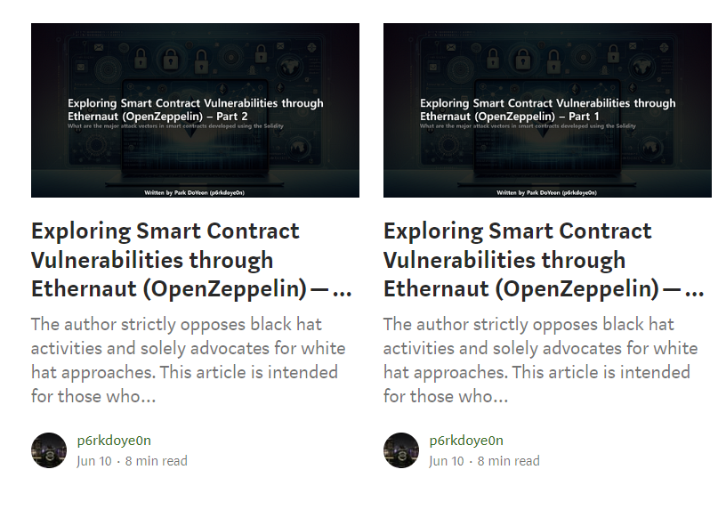

## "Exploring Smart Contract Vulnerabilities through Ethernaut (OpenZeppelin)" Example code - Par 1, Part 2

The repository contains test code directly written and attached to the article "Exploring Smart Contract Vulnerabilities through Ethernaut (OpenZeppelin)."

Comparing and analyzing the code alongside the article can be beneficial for learning, so I recommend studying them together.

https://medium.com/p6rkdoyeon/exploring-smart-contract-vulnerabilities-through-ethernaut-openzeppelin-part-1-bb4145c8e766